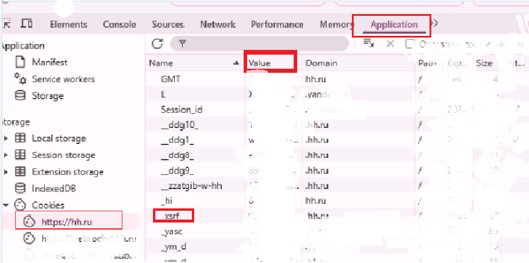

## 🇬🇧 Automating hh.ru job responses — *resume-pusher-hh*  
Two Python scripts for automatically applying to jobs and lifting your resume on [hh.ru](https://hh.ru):  
📤 bulk apply to jobs via search URL  
📈 regularly lifts your resume to keep it visible  
🛠 advanced mode with filtering and structured vacancy output

---

## 🇷🇺 Скрипт для автоматического отклика на hh.ru — *resume-pusher-hh*  
**Два Python-скрипта**, которые автоматизируют отклики на вакансии на [hh.ru](https://hh.ru):  
📤 отправка откликов по ссылке на поиск  
📈 автоматическое поднятие резюме  
🛠 поддержка расширенного режима с красивым выводом вакансий  


---


## 📁 Скрипты

| Скрипт           | Назначение                                                                 |
|------------------|----------------------------------------------------------------------------|
| `clicker-base.py` | Базовый откликатель — простой, минимальный, подходит для тестов           |
| `clicker.py`      | Расширенный бот: логика с интервалами, вывод табличек, фильтрация ошибок  |

---

## ⚙️ Что нужно настроить

### 🗝 1. Получите ключи из браузера
1. Зайдите на [hh.ru](https://hh.ru) под своим аккаунтом.
2. Нажмите `F12`, откройте вкладку **Application**.
3. В левой панели выберите `Cookies → https://hh.ru`
4. Найдите и скопируйте значения:

```text
hhtoken
hhul
crypted_id
_xsrf
```


### 📄 2. Resume hash
Перейдите на страницу вашего резюме и скопируйте hash из URL:

```
https://hh.ru/resume/<ваш_hash>
```

Сохраняйте только часть после `/resume/`, например:
```python
resume_hash = "d4d77659ff04cef5520039ed1f6d6c73563035"
```

### 🔗 3. Ссылка на вакансии
Скопируйте ссылку из hh.ru после настройки фильтров поиска, например:
```python
url = "https://hh.ru/search/vacancy?area=1&experience=doesNotMatter"
```

---

## 📬 Пример сопроводительного письма
```python
my_letter = (
    "Здравствуйте!\n\n"
    "Я выражаю искренний интерес к возможности присоединиться к вашей компании. "
    "Ознакомившись с деятельностью вашей организации, уверен(а), что мой опыт и навыки могут быть полезны вашей команде.\n\n"
    "С уважением,\n"
    "Имя Отчество\n"
    "📞 +6 (111) 123-45-37\n"
    "📧 example@mail.ru"
)
```


Конечно! Вот обновлённая версия с разделом о зависимостях и `pip install`:

---

## 📦 4. Установка зависимостей

Перед запуском установите необходимые библиотеки:

```bash
pip install -r requirements.txt
```


## ⏱ Особенности `clicker.py`
- Поднимает резюме каждые `4 часа 10 минут`
- Откликается раз в `2 часа`
- Выводит табличку с информацией о каждой вакансии (через `glom` и `tabulate`)
- Пропускает вакансии, где требуется тест

---

## 🚀 Запуск

```bash
python clicker.py
# или
python clicker-base.py
```

---

## 📜 Лицензия

Проект распространяется под лицензией **MIT**.

